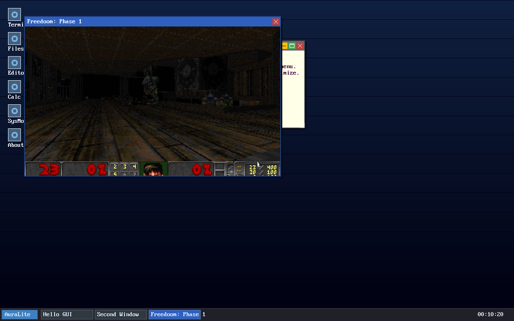

# AuraLite OS — DOOM Port Plan

## Status: IN PROGRESS — D0 – D6 done, D7 remaining

| Phase | State |
|---|---|
| D0 Licensing and the no-vendor rule | ✅ done |
| D1 libc gaps: seeking, `memmove`, `abs`, `system` | ✅ done |
| D2 libc gaps: the printf conversions | ✅ done |
| D3 The platform layer (`doomgeneric` backend) | ✅ done |
| D4 Getting the WAD to the program | ✅ done |
| D5 Integration test and the loud skip | ✅ done |
| D6 CI wiring | ✅ done |
| D7 The Win32 personality port | ⬜ todo |

**DOOM runs on AuraLite.** Freedoom Phase 1, in a compositor window, with the
status bar, the HUD and the automap, driven by the keyboard through the same
event queue every other AuraLite application uses:

```
DOOM-WINDOW-CREATED 640x400
W_Init: Init WADfiles.
 adding /fat/doom/freedoom1.wad
                           Freedoom: Phase 1
I_InitGraphics: framebuffer: x_res: 640, y_res: 400, bpp: 32
I_InitGraphics: DOOM screen size: w x h: 320 x 200
I_InitGraphics: Auto-scaling factor: 2
```



This document answers one question:

> *Can the original id Software DOOM engine run on AuraLite OS — and what does
> the attempt reveal about the system underneath it?*

It follows the structure of the existing plans (`SDK_PLAN.md`, `GL_PLAN.md`,
`WIN32_PLAN.md`, `POSIX_PLAN.md`): dependency-ordered phases, a definition of
done and a test gate for every phase, and one `.patch` per phase.

**Baseline:** commit `b1bc896` (CI update), on top of the completed
`WIN32_PLAN.md`.

The second half of that question turned out to matter more than the first.
DOOM is a *port*, so almost none of the work is DOOM's: it is a thirty-year-old
C program that asks for nothing exotic, and every place it failed to run was a
place where AuraLite was not yet a correct C environment. The engine functions
as a conformance test that happens to be fun to look at, and this plan is
mostly a record of what it found.

---

## 1. Evidence: what the port actually exercised

Each row is a defect found by running DOOM, not by reading code. The last
column is what the symptom looked like *before* the cause was known — which is
the interesting part, because in every case it pointed somewhere else.

| # | Defect | Where | Symptom as observed |
|---|---|---|---|
| 1 | `fseek`/`ftell`/`rewind` absent | `lib/libc` | Engine would not link |
| 2 | `memmove` absent | `lib/libc` | Engine would not link |
| 3 | `abs`/`labs`/`llabs` absent | `lib/libc` | Engine would not link |
| 4 | `SEEK_*` only in `<unistd.h>` | `lib/libc/include/stdio.h` | Portable `fseek` calls failed to compile |
| 5 | `rename` missing from `<stdio.h>` | `lib/libc/include/stdio.h` | Same |
| 6 | `system()` absent | `lib/libc` | Engine would not link |
| 7 | **AHCI leaked a DMA buffer on every read** | `drivers/ahci/ahci.c` | *Every file on `/fat` truncated to exactly 173824 bytes* |
| 8 | **FAT32 chain walk was quadratic** | `kernel/fs/fat32.c` | 5 KB/s; a 28 MB read would take 94 minutes |
| 9 | **No FAT sector cache** | `kernel/fs/fat32.c` | 128 redundant disk reads per FAT sector |
| 10 | **No per-file chain cursor** | `kernel/fs/fat32.c` | Every `fseek` re-walked from cluster 0 |
| 11 | `%i` not implemented | `lib/libc/src/libc.c` | DOOM looked up a config variable literally named `joystick_physical_button%i` |
| 12 | Integer precision parsed then ignored | `lib/libc/src/libc.c` | `W_GetNumForName: STCFN%.3 not found!` |
| 13 | `%f` not implemented | `lib/libc/src/libc.c` | Floats written to the config as the text `%f` |
| 14 | `%f` ignored field width | `lib/libc/src/libc.c` | Found by the differential test, not by DOOM |
| 15 | **`%5d` of a negative put the sign first** | `lib/libc/src/libc.c` | `-  42` instead of `  -42` — pre-existing, all output affected |
| 16 | `%.0d` of zero printed `0` | `lib/libc/src/libc.c` | Should print nothing (C11 7.21.6.1p8) |
| 17 | NaN sign taken from `d < 0` | `lib/libc/src/libc.c` | `nan` where glibc prints `-nan` |

Rows 7–10 are the ones worth dwelling on. They are kernel defects, they affect
**every** program that reads a file from an AHCI disk, and none of them had
ever been noticed — because until something tried to read half a megabyte, the
system never read enough to trip any of them. The boot path and the existing
self-tests touch a few dozen sectors.

### 1.1 The 173824-byte ceiling

`ahci_read()` allocated a DMA bounce buffer with `pmm_alloc_contiguous()` on
every call and never freed it, on any path. Physical frames ran out after a few
hundred reads; the allocation then returned 0, `ahci_read()` returned −1, and
FAT32 reported that as a short read. So the observable behaviour was:

- a 502 KB file read as 173824 bytes,
- a 28 MB file read as 173824 bytes,
- from different starting clusters, with 64 KB and with 4 KB read buffers.

An identical ceiling for two very different files is what ruled out the file,
the cluster chain (verified intact on the image: 981 contiguous clusters) and
the caller, and pointed at a resource that depletes. The chain itself was
verified by replaying the kernel's own arithmetic against the disk image on the
host — that host replay read all 502096 bytes, which proved the FAT32 *logic*
was right and moved the search to the layer below it.

### 1.2 Quadratic I/O, twice

With the leak fixed, reads completed but ran at 5 KB/s — 93 ms per 512-byte
sector. Two separate quadratic behaviours were stacked:

**In the read loop.** `fat32_read_impl()` called `chain_at(first, cl_idx)` per
cluster, and `chain_at()` restarts from the head, following `cl_idx` links —
each one a `fat_get()`, each one a disk read. Reading N clusters cost
N(N−1)/2 FAT reads on top of N data reads. For a 500 KB file: 481671 reads
instead of 981, **491× the necessary I/O**. For the 28 MB WAD: ~1.6 billion.

**Across `fseek` calls.** DOOM reads a WAD lump by seeking to its offset and
reading, a few thousand times. Every seek re-walked the chain from cluster 0,
so the cost grew with the offset of the lump.

Three fixes, each independently measurable:

| Change | Throughput |
|---|---|
| (baseline, after the leak fix) | 5 KB/s |
| Incremental chain walk in the read loop | 10 KB/s |
| One-sector FAT cache | **394 KB/s** |
| Per-file chain cursor | **739 KB/s** (28 MB WAD in 38 s) |

The FAT cache is the big one, and in hindsight obviously so: a FAT sector holds
128 entries, so walking a chain of consecutive clusters re-read the same sector
128 times in a row.

---

## 2. Decisions

### D1 — No GPL source in this repository

DOOM is GPL-2.0. AuraLite is Apache-2.0. The FSF and the ASF agree these are
**incompatible**: Apache-2.0's patent-termination and indemnification clauses
are "further restrictions" that GPLv2 § 6 forbids. (Apache-2.0 *is*
GPLv3-compatible; DOOM is not GPLv3.)

So the engine is **fetched at build time into `build/`** and never committed.
The repository contains only AuraLite's own platform layer, which is
Apache-2.0 like everything else here. `make doom` clones
`https://github.com/ozkl/doomgeneric` and builds against it.

This is the same reasoning as `WIN32_PLAN.md` D3, and the same conclusion:
depend on it, do not absorb it.

### D2 — The DOOM binary is not in the default image

`build/user/doom.elf` is a *derivative work* of GPL-2.0 sources. Shipping it in
`initrd.tar` would put GPL-derived output inside the default `make iso`
artefact and raise a distribution question for an image that otherwise has
none.

It therefore lives on the WAD disk, which is built only by `make run-doom`.
`make iso` produces exactly the bytes it produced before this work.

### D3 — Fix libc, never `#define` around it

The engine has backends for DOS, X11, SDL, Windows and emscripten, and each is
selected by a platform macro. `-D__DJGPP__` makes the `system()` call
disappear — and then demands a DOS `<go32.h>`. `__MACOSX__` pulls in
CoreFoundation.

Every such macro trades one missing function for a different platform's entire
set of assumptions. The rule for this port is: **if the engine needs a standard
C function, AuraLite is missing a standard C function.** Implement it.

The result is that all 79 engine sources compile against AuraLite's libc with
**no platform `#define`s and no patches to the GPL sources** — which also means
there is no patch set to maintain when upstream moves.

### D4 — The WAD ships on its own disk, not in the initrd

Four delivery routes were considered:

| Route | Verdict |
|---|---|
| In `initrd.tar` | ❌ The BIOS loader caps it at 8 MiB (enforced in `mkisoimage_dual.sh`); it is already 7.6 MiB and the smallest Freedoom IWAD is 22 MiB |
| On the ESP (`/fat` from the ISO) | ❌ **Not mounted on an IDE ISO boot** — verified by probing `mount` in a live guest; AHCI finds no disk and `/fat` never appears |
| Over the network at runtime | ❌ Needs a working DHCP lease in the test environment |
| **A second AHCI disk** | ✅ Chosen |

`kernel/fs/fat32.c` reads exclusively through `ahci_read()`, and
`parse_or_format()` mounts whatever valid FAT32 BPB sits at **LBA 64**,
honouring its real size.

> **The trap, hit once and worth recording:** a FAT32 image formatted at offset
> 0 has no signature at LBA 64, so the kernel concludes the disk is blank and
> *formats* it — silently destroying the WAD. The image must be 64 zero sectors
> followed by the filesystem. Verify `0x55 0xAA` at byte `64*512+510` and
> `"FAT32"` at `+82` before booting.

### D5 — Freedoom, and it is optional

Freedoom's assets are under a modified 3-clause BSD licence: freely
redistributable, and playable with any GPL Doom engine. `make run-doom`
fetches `freedoom1.wad` into `build/`.

The shareware `DOOM1.WAD` is **not** freely redistributable and is never
fetched. A user who owns `DOOM.WAD` can point the port at it.

Because the WAD is a 22 MB download, everything that needs it **skips loudly**
when it is absent, in the manner of the mingw-w64 gates in `WIN32_PLAN.md`
W32-8 — a skipped test says so on stdout and does not pretend to have passed.

### D6 — Native ELF first, Win32 second

DOOM is built as a native AuraLite ELF (D3). Running a Win32 DOOM build through
the `WIN32_PLAN.md` personality is a genuinely different exercise — it tests
`w32run`, the PE loader and the `USER32`/`GDI32` surface rather than libc and
the filesystem — and it is deferred to D7.

---

## 3. Phases

### Phase D0 — Licensing and the no-vendor rule

**Objective.** Decide the licence boundary before writing code, so that no work
has to be deleted later.

- [x] Establish Apache-2.0 / GPL-2.0 incompatibility from primary sources
- [x] Decide fetch-at-build-time (D1) and record it in the Makefile
- [x] Confirm Freedoom's licence permits redistribution (D5)
- [x] Decide that the built binary stays out of the default image (D2)

**Test gate.** `git status --short` is clean after `make doom`; no engine source
is tracked.

**Result:** ✅ `make doom` fetches into `build/doom/`; nothing GPL is committed.

---

### Phase D1 — libc: seeking, `memmove`, `abs`, `system`

**Objective.** Make the engine link.

- [x] `fseek`, `ftell`, `rewind`, `fgetpos`, `fsetpos`
- [x] `memmove` (the header declared `memcpy` but not `memmove`)
- [x] `abs`, `labs`, `llabs`
- [x] `system()` — `NULL` → 0, otherwise −1/`ENOSYS`
- [x] `SEEK_SET`/`CUR`/`END` in `<stdio.h>`; `rename` in `<stdio.h>`
- [x] `tests/unit/test_stdio_seek.c`, 36 assertions under ASan

The subtle part is that `FILE` is buffered, so the fd's offset runs *ahead* of
the position the program believes it is at. `ftell` must subtract the unread
remainder and the pushed-back character; `fseek` must resolve `SEEK_CUR`
against the logical position *before* discarding the buffer. Get either wrong
and reads return data from the old position — silently wrong bytes, not an
error.

**Test gate.** `make test-unit` green, and the suite verified by mutation.

**Result:** ✅ Mutation testing found a defect in the *test*: GCC replaces
`memmove` and `abs` with builtins, so breaking the implementation changed
nothing until the calls went through `auralite_*` aliases generated by
`tools/extract_libc_impls.py`.

---

### Phase D2 — libc: the printf conversions

**Objective.** Make the engine's formatted output correct.

- [x] `%i` (identical to `%d` for output, C11 7.21.6.1p8)
- [x] Precision on integers — a minimum digit count, zero-filled
- [x] `%f` / `%F`, with rounding at the requested precision
- [x] Field width and `0`-padding for floats, sign before the zeros
- [x] `%.0d` of zero converts to no characters
- [x] Sign from the sign bit, so `-nan` and `-0.0` are right
- [x] Fixed `%5d` of a negative — a **pre-existing** bug affecting all output
- [x] `tests/unit/test_printf_format.c`, 60 assertions, **differential**

The failure mode here is nasty and worth naming: a missing conversion does not
fail loudly, it **emits the specifier as literal text**, and the damage
surfaces far away as a nonsense lookup. `STCFN%.3` is not a font name.

The test is differential against the host's glibc — every case formats the same
arguments both ways and requires identical bytes. That is a much better oracle
than hand-written expectations, which only encode what the author already
believed. It immediately found three defects beyond the ones DOOM hit,
including the negative-width bug that had been wrong for every program in the
system.

**Test gate.** `make test-unit`; 9 mutants injected, all 9 caught.

**Result:** ✅ 60/60 matching glibc. One mutant survived the first sweep — the
sign inside the *infinity* branch, which the finite cases could not reach — and
the gap was closed by adding `inf`/`-inf`/`nan` cases rather than by declaring
the mutant equivalent.

---

### Phase D3 — The platform layer

**Objective.** Implement the six hooks `doomgeneric` requires, over libauragui.

- [x] `DG_Init`, `DG_DrawFrame`, `DG_SleepMs`, `DG_GetTicksMs`, `DG_GetKey`
- [x] `DG_SetWindowTitle`
- [x] `main()`, injecting a default `-iwad` when none is given
- [x] Key translation, including the modifiers DOOM treats as game buttons

`DG_DrawFrame` is a single `ag_blit()` because `doomgeneric` renders into a
packed XRGB8888 buffer and `ag_blit` consumes exactly that — no format
conversion, no GPU path, no OpenGL.

Two details that are easy to get wrong:

- **Events are drained in `DG_DrawFrame`, not in `DG_GetKey`.** Draining inside
  `DG_GetKey` mixes newly arrived events into what the engine is treating as a
  snapshot of the current frame's input.
- **Input needs a queue, not a slot.** A player turning while firing produces
  several transitions per frame; a single variable loses all but the last. The
  ring holds 32 and drops the *oldest* on overflow, because the newest
  transition is the one the player is currently expressing.

**Test gate.** Compiles with `-Werror`; all 79 engine sources build unpatched.

**Result:** ✅ `build/user/doom.elf`, 588K (492K stripped).

---

### Phase D4 — Getting the WAD to the program

**Objective.** Make a 28 MB data file readable by a user program at runtime.

- [x] Build a second FAT32 disk with the WAD and the binary (D4)
- [x] Fix the AHCI DMA leak (evidence 1.1)
- [x] Fix the quadratic chain walk, add a FAT sector cache and a chain cursor
- [x] `pmm_free_contiguous()`, the counterpart the PMM was missing

The AHCI fix is a persistent per-port bounce buffer allocated once at init,
rather than an allocation per transfer: it removes the leak *and* the
per-transfer cost of a bitmap scan plus a 4 KiB `memset`.

**Test gate.** A 502 KB file and a 28 MB file both read to their exact size.

**Result:** ✅ 502096/502096 and 28795076/28795076 bytes, at 739 KB/s — a
**78× throughput improvement** over the state after the leak fix alone. DOOM
reaches its title screen and plays.

---

### Phase D5 — Integration test and the loud skip

**Objective.** A black-box QEMU case that proves DOOM still runs.

- [x] `tests/integration/cases/test_doom.sh`, registered in `ALL_CASES`
- [x] Skips loudly, and exits 0, when the WAD **or OVMF** is absent (D5)
- [x] Asserts the GOP framebuffer, the window, the IWAD, all seven engine
      init stages and `I_InitGraphics`
- [x] Asserts the *old failures by name*, so a regression reports its cause
- [x] Both cases added to `SLOW_CASES_RE`
- [x] `tests/integration/cases/test_ahci_large_read.sh` — no WAD, no download

The AHCI and FAT32 fixes needed a gate that does **not** depend on a 22 MB
download, so `test_ahci_large_read.sh` builds its own FAT32 disk with a single
file of known size and asserts every byte comes back.

That test was written twice. The first version used a 1 MiB payload, and when
the AHCI leak was deliberately reintroduced **the test still passed** — 1 MiB
is not enough allocation pressure to exhaust the frame allocator. Measuring the
reintroduced bug showed reads failing after 10239488 bytes, so the payload is
now 16 MiB.

> A regression test for a resource leak has to exceed the resource. The only
> way to know that threshold is to put the bug back and measure it — which is
> also the only way to know the test works at all.

**Test gate.** Passes with the WAD; skips loudly and exits 0 without it.

**Result:** ✅ `test_doom` 18/18 assertions; `test_ahci_large_read` 8/8, and
verified to fail when the leak is reintroduced.

---

### Phase D6 — CI wiring

**Objective.** Run what can be run for free, and be explicit about the rest.

- [x] `make test-unit` covers D1 and D2 at no cost — now 119 tests
- [x] The no-WAD AHCI/FAT32 case runs on every push, as its own named step
- [x] The DOOM case is a **separate job**, `continue-on-error: true`
- [x] The engine fetch stays out of the default CI path

The DOOM job is isolated on purpose. It clones a GPL-2.0 engine and downloads a
22 MB IWAD — two third-party endpoints the rest of the build does not touch.
Making every push depend on them means an outage at either turns the repository
red for a reason unrelated to the change under test. So the job reports and
does not block, while the work DOOM *prompted* is gated for real: the libc
fixes by `make test-unit`, the kernel fixes by the AHCI step.

**Test gate.** A green run on a clean checkout with no access to
`github.com/ozkl`.

**Result:** ✅ Two jobs; `test_ahci_large_read` on every push; the DOOM job
reports without blocking.

---

### Phase D7 — The Win32 personality port ⬜

**Objective.** Run a *Win32* DOOM build through `w32run`.

- [ ] Build `doomgeneric_win.c` with mingw-w64 against the W32 personality
- [ ] Identify the missing `USER32`/`GDI32` entry points
- [ ] Decide, per call, whether to implement or to refuse with a diagnostic

This is a test of `WIN32_PLAN.md`'s output, not of DOOM. It is the natural next
consumer of that work and it will find gaps, which is the point.

---

## 4. Order

| Step | Phase | Depends on | Why this order |
|---|---|---|---|
| 1 | D0 | — | The licence boundary shapes everything else |
| 2 | D1 | D0 | The engine will not link without it |
| 3 | D3 | D1 | The platform layer needs a libc to call |
| 4 | D2 | D3 | Only reachable once the engine runs far enough to print |
| 5 | D4 | D3 | Only reachable once there is a binary to feed |
| 6 | D5 | D4 | A gate needs something that works to guard |
| 7 | D6 | D5 | CI runs the gate |
| 8 | D7 | D3 | Independent of D4–D6 |

D2 and D4 are deliberately *after* D3: both were discovered by running the
engine, and neither could have been specified in advance. That is the honest
order of this work and the plan reflects it rather than pretending the defects
were predicted.

---

## 5. Risks

| Risk | Mitigation |
|---|---|
| Upstream `doomgeneric` moves and the source list changes | The list comes from upstream's own `SRC_DOOM`, not a wildcard; a missing file is a hard build error, not a silent omission |
| The 22 MB Freedoom download is unavailable | Everything that needs it skips loudly (D5); the build never blocks on it |
| The WAD disk is formatted at the wrong offset | Documented in D4; verify the signature at LBA 64 before booting |
| Someone "simplifies" the port with `-D__DJGPP__` | D3 states why not; the libc functions exist now, so the temptation is gone |
| GPL output reaching the default image | D2; `make iso` is byte-identical to before this work |
| The FAT sector cache goes stale | Invalidated in `fat_set_all()`, the only writer; the per-file cursors are reset there too |
| A vnode is reused for a different file with a stale cursor | The pool `memset`s the whole struct on allocation, so the cursor cannot survive |

---

## 6. Non-goals

- **Sound.** `doomgeneric` has no audio backend and AuraLite's AC'97 driver is
  not wired to one. The engine runs silent.
- **Networked deathmatch.** `D_CheckNetGame` reports a single node; multiplayer
  is out of scope.
- **Save games to a writable medium.** Saves go to the WAD disk's filesystem,
  which is attached with `snapshot=on` — they do not persist across a run.
- **A general block cache.** The FAT sector cache is one sector on the hot
  path. A real buffer cache for FAT32 is a separate piece of work with its own
  correctness argument.
- **`%e` and `%g`.** Doing them properly means Grisu or Ryū; doing them badly
  means plausible wrong digits. `%f` is implemented and the other two remain
  absent rather than approximate.
- **Vendoring the engine.** D1. Not now, not "temporarily".
